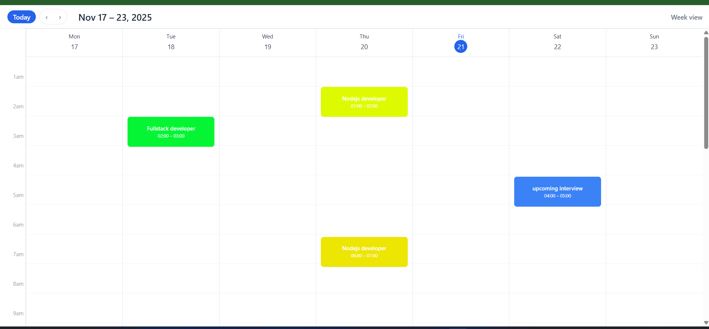
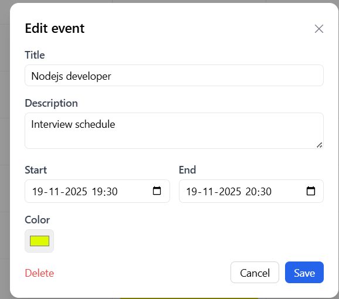
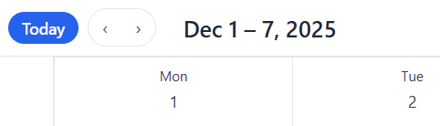

# 📅 Google Calendar – Week View Clone

A full-stack web application that replicates the core functionality of the **Google Calendar Week View**, built using:

* **React + TypeScript + Tailwind CSS** (Frontend)
* **Node.js + Express + TypeScript** (Backend)
* **MongoDB + Mongoose** (Database)

In this project i have used clean architecture, code modularity, production readiness, and scalable component design.

---

# 🚀 Features

### ✅ Week View Calendar

* 7-day layout (Mon–Sun)
* 24-hour time grid
* Current day highlight
* Red “current time” line (like Google Calendar)

### ✅ Event Management

* Click any time-slot to **create event**
* Edit / delete existing events
* Colored event blocks with accurate position based on time
* Smooth UX similar to Google Calendar

### ✅ Navigation

* **Today** button
* Previous / Next week
* Week range label (`Nov 17 – Nov 23, 2025`)

### ✅ Backend CRUD API

* Create / update / delete events
* Query events by date range
* Validations included
* Single demo user (no auth needed)

### ✅ Database

* MongoDB for persistent storage
* Event model with timestamps
* Overlapping events handled using range queries

---

# 🏗 Tech Stack

### **Frontend**

* React
* TypeScript
* Tailwind CSS
* Axios
* date-fns

### **Backend**

* Node.js
* Express
* TypeScript
* Mongoose
* MongoDB

---

# 📂 Folder Structure

## **Frontend**

```
frontend/
│── src/
│   ├── api/           # Axios API calls
│   ├── components/    # Reusable UI components
│   │   └── calendar/  # Calendar-specific components
│   ├── pages/         # Page-level views
│   ├── types/         # TypeScript interfaces
│   ├── App.tsx
│   └── main.tsx
└── index.html
```

## **Backend**

```
backend/
│── src/
│   ├── config/        # DB connection
│   ├── controllers/   # Route handlers
│   ├── routes/        # API endpoints
│   ├── services/      # Business logic
│   ├── models/        # Mongoose models
│   ├── types/         # Shared TypeScript types
│   └── server.ts       # App bootstrap
└── .env
```

---

# ⚙️ Setup Instructions

---

## 🖥️ Backend Setup

### 1. Clone backend template

```bash
git clone https://github.com/DEVnitishOfficial/Google_Calendar.git
cd Backend
```

### 2. Install dependencies

```bash
npm install
```

### 3. Setup `.env`

```
PORT=3003
MONGO_URI=mongodb://127.0.0.1:27017/google-calendar-clone
```

### 4. Start MongoDB (local) or connnect with remote mongodb

### 5. Start server

```bash
npm run dev
```

You should see:

```
🚀 Server running on port 3003
✅ MongoDB connected
```

---

## 🌐 Frontend Setup

### 1. Create React project (Vite)

* follow below tailwind docs to setup tailwind css in react vite
https://v3.tailwindcss.com/docs/guides/vite

```bash
npm create vite@latest frontend .
cd frontend
npm install
```

### 2. Install libraries

```bash
npm install axios date-fns
npm install -D tailwindcss postcss autoprefixer
```

### 3. Setup Tailwind
* Follow docs : https://v3.tailwindcss.com/docs/guides/vite

### 4. Start frontend

```bash
npm run dev
```

App runs at:

```
http://localhost:5173
```

---

# 📡 API Overview

## Base URL

```
http://localhost:3003/api/v1/event
```

### ➕ Create Event

**POST** `/api/event`

```json
{
  "title": "Meeting",
  "start": "2025-01-10T14:00:00",
  "end": "2025-01-10T15:00:00",
  "color": "#3b82f6"
}
```

### 📅 Get Events

**GET** `/api/v1/event?start=2025-01-01&end=2025-01-31`

### ✏️ Update Event

**PUT** `/api/v1/event/:id`

### ❌ Delete Event

**DELETE** `/api/v1/event/:id`

---

# 🧠 High-Level Architecture Overview

### **Frontend Flow**

1. User opens week view → React calculates the week start/end.
2. Component fetches events for that range (`fetchEvents`).
3. WeekGrid renders:

   * 7 days
   * 24 hours
   * Events placed using CSS `%` based on time.
4. Clicking on a slot opens modal → Save sends POST to backend.

### **Backend Flow**

1. Client sends request to Express API.
2. Controllers validate input.
3. Services implement logic and interact with MongoDB.
4. Mongoose stores/retrieves event documents.
5. API responds with event JSON.

Everything is separated using:

* **Controller → Service → Model pattern**
* Makes logic clean, testable, and easily extendable.

---

# 🧩 Code Maintainability & Project Structure Decisions

### ✔ Component-based architecture

Each UI section (header, grid, modal) is isolated for readability and reuse.

### ✔ Separation of frontend concerns

* `api/` handles API requests
* `types/` holds TypeScript interfaces
* `components/calendar/` contains UI logic only

### ✔ Backend layered architecture

* **Routes** → Responsible for HTTP mapping
* **Controllers** → Validate incoming data
* **Services** → Actual business logic (reusable)
* **Models** → MongoDB database structure

This makes the system:

* Testable
* Extendable
* Maintainable

### ✔ TypeScript everywhere

Provides:

* Strict correctness
* Fewer runtime errors
* Autocomplete & API safety

---

# 🔮 Extendability – How this project can grow

This project is intentionally built to be easily extendable.

### 🚀 1. Add user authentication

* JWT login
* Each user sees only their events
* Multi-calendar support

### 🚀 2. Add drag & drop

* Drag event to move it
* Resize to adjust duration
* Use libraries like `react-draggable`

### 🚀 3. Add month view / day view

* Reuse the same event API
* Add calendar navigation context

### 🚀 4. Recurring events

* Daily, weekly, monthly patterns
* Auto-generate events when fetching

### 🚀 5. Real-time updates

* Add Socket.IO
* Multiple users editing same calendar

### 🚀 6. Event reminders / notifications

* Node cron jobs
* Email / push notifications

---

# 🧪 Testing the Backend API

we can test with:

* **Postman** ---> i have tested with postman
* **Thunder Client (VS Code)**
* **Browser for GET requests**

Examples:

```
GET /api/events?start=2025-01-01&end=2025-01-31
POST /api/events
PUT /api/events/:id
DELETE /api/events/:id
```

---

# 📸 Screenshots

Include:

* Week view layout


* Event creation modal


* Navigation bar

